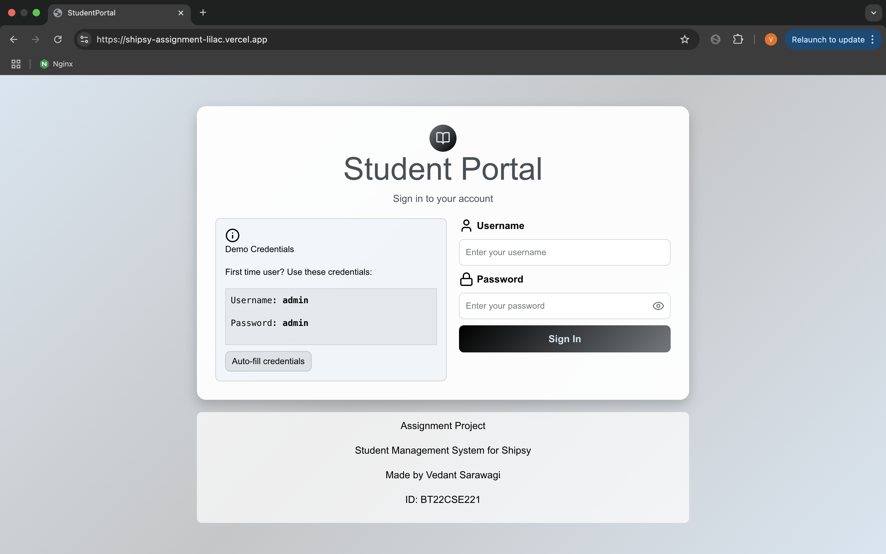
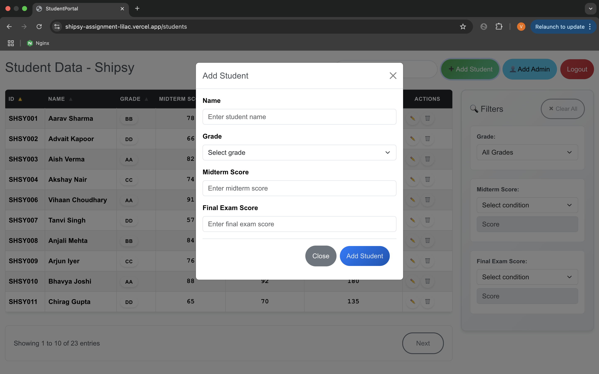
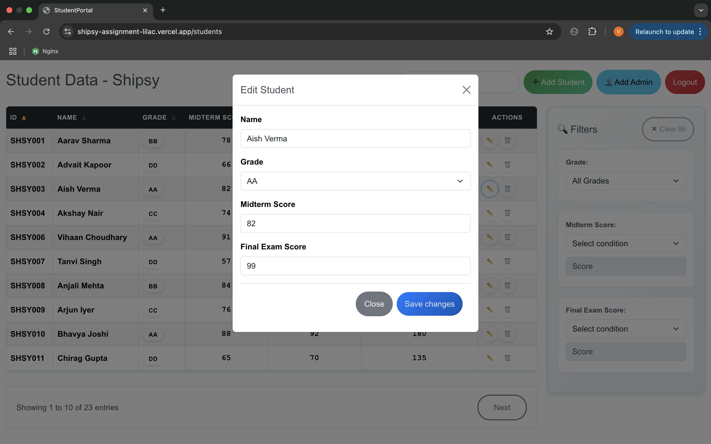
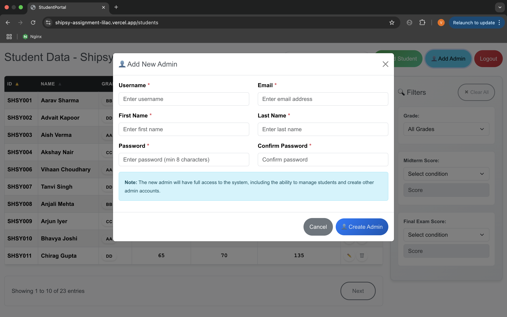
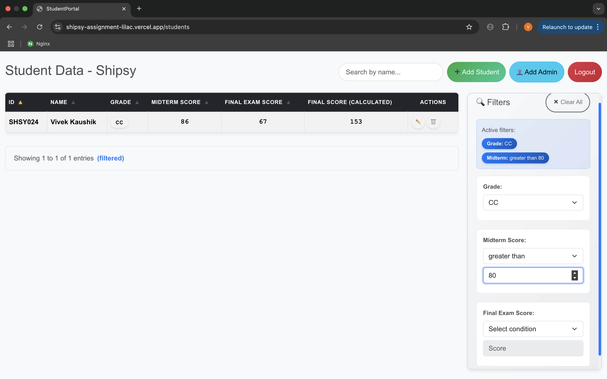
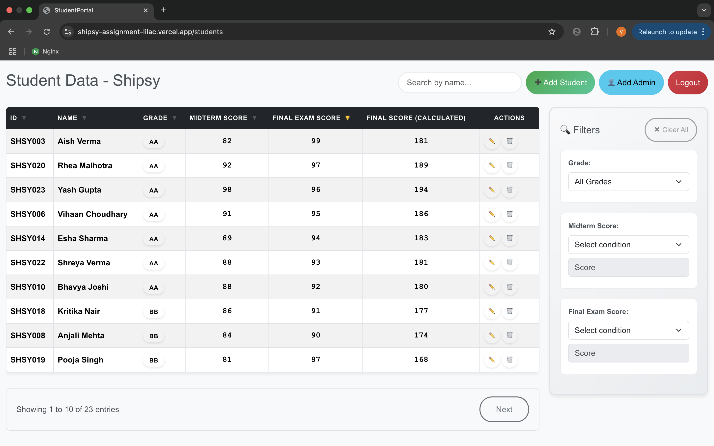

# 🚀 ShipsyAssignment

This project was built as part of the **AI Campus Assignment**. It demonstrates:  
- Authentication (Login/Logout, Admin registration)  
- CRUD operations on `Student` entity  
- Pagination and filtering  
- Frontend integration with React (Vite)  
- AI-assisted development using **Gemini CLI**  

---

## 🌐 Repo Link
👉 [Repo Link](https://github.com/vedant-0408/ShipsyAssignment/)  

---

## 🌐 Live Demo 
👉 [https://shipsy-assignment-lilac.vercel.app/](https://shipsy-assignment-lilac.vercel.app/)  

---

## 🎥 Demo Video  
👉 [Watch on YouTube](https://www.youtube.com/watch?v=cE0ZmhFyUQ8)  

---

## ✨ Features  

### 🔐 Authentication & Users
- Login with username & password (Token authentication)  
- Logout endpoint  
- Admin-only user registration (only admins can create new admins)  

### 📊 Student Management (CRUD)
- Create, Read, Update, Delete Students  
- Fields:  
  - `name` (text)  
  - `grade` (enum: AA/BB/CC/DD/FF)  
  - `is_active` (boolean)  
  - `midterm_score`, `final_exam_score` (integers)  
  - `final_score` (calculated field)  

### 📑 Listing & Data Management
- Pagination (10 per page)  
- Filtering by grade and active status  
- Search & sorting  

### 🎨 Frontend
- Built with **React (Vite)**  
- Axios integration with token-based authentication  
- Table for paginated students with grade filter  
- Forms for add/update student  

---

## 🛠 Tech Stack  

### Backend
- **Django** + Django REST Framework  
- **SQLite (local)** / **PostgreSQL (production)**  
- **django-filter** for filtering  
- **TokenAuthentication** for login/logout  
- Deployed on **Render**  

### Frontend
- **React (Vite)**  
- **Axios** for API calls  
- **React Router DOM** for routing  
- Deployed on **Vercel**  

### Dev Tools
- **Gemini CLI** (AI-assisted coding)  
- **Postman** (API testing)  
- **GitHub** (repo & version control)  

---

## 📸 Screenshots  

### 🔐 Authentication
  

### 📊 DashBoard
  

### ➕ Add Student
  

### ⚙️ Edit Student
  

### ⚙️ Add Admin
  

### ⚙️ Filter Function
  

### ⚙️ Sort Function on Final Score

